# CampusShare UML & Data Flow Diagrams (US-01 to US-09)

## System Overview

### DFD Level 0 — Context Diagram

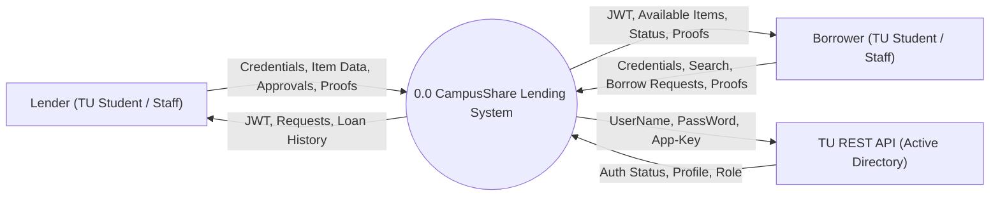
```mermaid
flowchart LR
    Lender["Lender (TU Student / Staff)"]
    Borrower["Borrower (TU Student / Staff)"]
    System(("0.0 CampusShare Lending System"))
    TUAPI["TU REST API (Active Directory)"]

    Lender -->|"Credentials, Item Data, Approvals, Proofs"| System
    System -->|"JWT, Requests, Loan History"| Lender

    Borrower -->|"Credentials, Search, Borrow Requests, Proofs"| System
    System -->|"JWT, Available Items, Status, Proofs"| Borrower

    System -->|"UserName, PassWord, App-Key"| TUAPI
    TUAPI -->|"Auth Status, Profile, Role"| System
```

### DFD Level 1 — System Processes

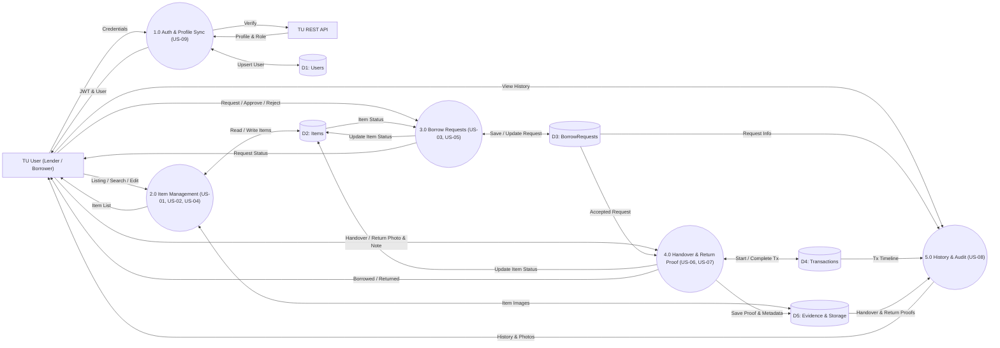
```mermaid
flowchart LR
    User["TU User (Lender / Borrower)"]
    TUAPI["TU REST API"]

    P1(("1.0 Auth & Profile Sync (US-09)"))
    P2(("2.0 Item Management (US-01, US-02, US-04)"))
    P3(("3.0 Borrow Requests (US-03, US-05)"))
    P4(("4.0 Handover & Return Proof (US-06, US-07)"))
    P5(("5.0 History & Audit (US-08)"))

    D1[("D1: Users")]
    D2[("D2: Items")]
    D3[("D3: BorrowRequests")]
    D4[("D4: Transactions")]
    D5[("D5: Evidence & Storage")]

    User -->|"Credentials"| P1
    P1 -->|"Verify"| TUAPI
    TUAPI -->|"Profile & Role"| P1
    P1 <-->|"Upsert User"| D1
    P1 -->|"JWT & User"| User

    User -->|"Listing / Search / Edit"| P2
    P2 <-->|"Read / Write Items"| D2
    P2 <-->|"Item Images"| D5
    P2 -->|"Item List"| User

    User -->|"Request / Approve / Reject"| P3
    D2 -->|"Item Status"| P3
    P3 <-->|"Save / Update Request"| D3
    P3 -->|"Update Item Status"| D2
    P3 -->|"Request Status"| User

    User -->|"Handover / Return Photo & Note"| P4
    D3 -->|"Accepted Request"| P4
    P4 <-->|"Start / Complete Tx"| D4
    P4 -->|"Save Proof & Metadata"| D5
    P4 -->|"Update Item Status"| D2
    P4 -->|"Borrowed / Returned"| User

    User -->|"View History"| P5
    D3 -->|"Request Info"| P5
    D4 -->|"Tx Timeline"| P5
    D5 -->|"Handover & Return Proofs"| P5
    P5 -->|"History & Photos"| User
```

### Domain Model (UML Class Diagram)

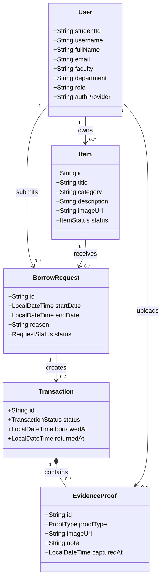
```mermaid
classDiagram
    class User {
        +String studentId
        +String username
        +String fullName
        +String email
        +String faculty
        +String department
        +String role
        +String authProvider
    }
    class Item {
        +String id
        +String title
        +String category
        +String description
        +String imageUrl
        +ItemStatus status
    }
    class BorrowRequest {
        +String id
        +LocalDateTime startDate
        +LocalDateTime endDate
        +String reason
        +RequestStatus status
    }
    class Transaction {
        +String id
        +TransactionStatus status
        +LocalDateTime borrowedAt
        +LocalDateTime returnedAt
    }
    class EvidenceProof {
        +String id
        +ProofType proofType
        +String imageUrl
        +String note
        +LocalDateTime capturedAt
    }

    User "1" --> "0..*" Item : owns
    User "1" --> "0..*" BorrowRequest : submits
    Item "1" --> "0..*" BorrowRequest : receives
    BorrowRequest "1" --> "0..1" Transaction : creates
    Transaction "1" *-- "0..*" EvidenceProof : contains
    User "1" --> "0..*" EvidenceProof : uploads
```

### Item Lifecycle (UML State Diagram)

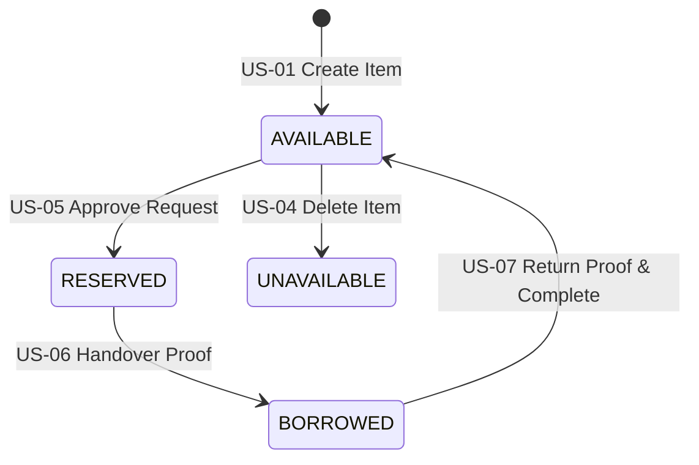
```mermaid
stateDiagram-v2
    [*] --> AVAILABLE : US-01 Create Item
    AVAILABLE --> RESERVED : US-05 Approve Request
    RESERVED --> BORROWED : US-06 Handover Proof
    BORROWED --> AVAILABLE : US-07 Return Proof & Complete
    AVAILABLE --> UNAVAILABLE : US-04 Delete Item
```

---

## US-01: Create Item Listing

### US-01 Data Flow (DFD)

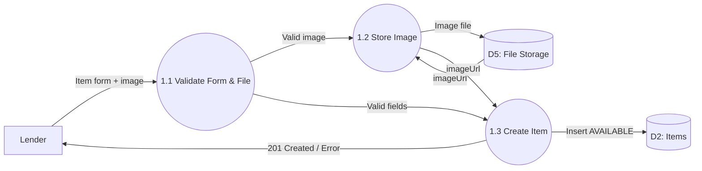
```mermaid
flowchart LR
    U["Lender"]
    P1(("1.1 Validate Form & File"))
    P2(("1.2 Store Image"))
    P3(("1.3 Create Item"))
    D5[("D5: File Storage")]
    D2[("D2: Items")]

    U -->|"Item form + image"| P1
    P1 -->|"Valid image"| P2
    P2 -->|"Image file"| D5
    D5 -->|"imageUrl"| P2
    P1 -->|"Valid fields"| P3
    P2 -->|"imageUrl"| P3
    P3 -->|"Insert AVAILABLE"| D2
    P3 -->|"201 Created / Error"| U
```

### US-01 UML Activity

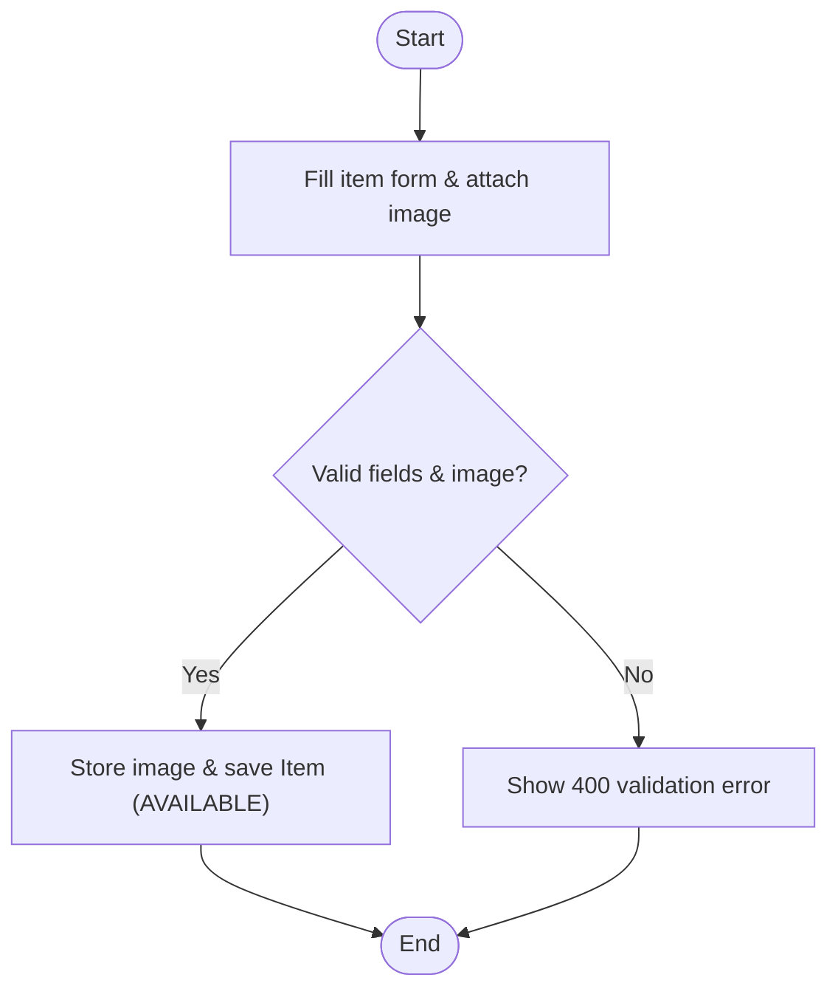
```mermaid
flowchart TD
    S(["Start"]) --> A["Fill item form & attach image"]
    A --> C{"Valid fields & image?"}
    C -->|"Yes"| B["Store image & save Item (AVAILABLE)"]
    C -->|"No"| E["Show 400 validation error"]
    B --> Z(["End"])
    E --> Z
```

### US-01 UML Sequence

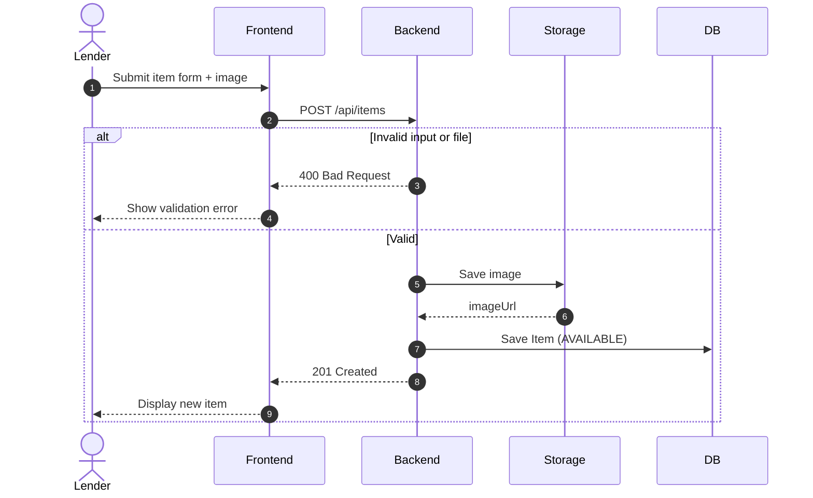
```mermaid
sequenceDiagram
    autonumber
    actor Lender
    participant FE as Frontend
    participant BE as Backend
    participant Storage
    participant DB

    Lender->>FE: Submit item form + image
    FE->>BE: POST /api/items
    alt Invalid input or file
        BE-->>FE: 400 Bad Request
        FE-->>Lender: Show validation error
    else Valid
        BE->>Storage: Save image
        Storage-->>BE: imageUrl
        BE->>DB: Save Item (AVAILABLE)
        BE-->>FE: 201 Created
        FE-->>Lender: Display new item
    end
```

---

## US-02: Browse Available Items

### US-02 Data Flow (DFD)

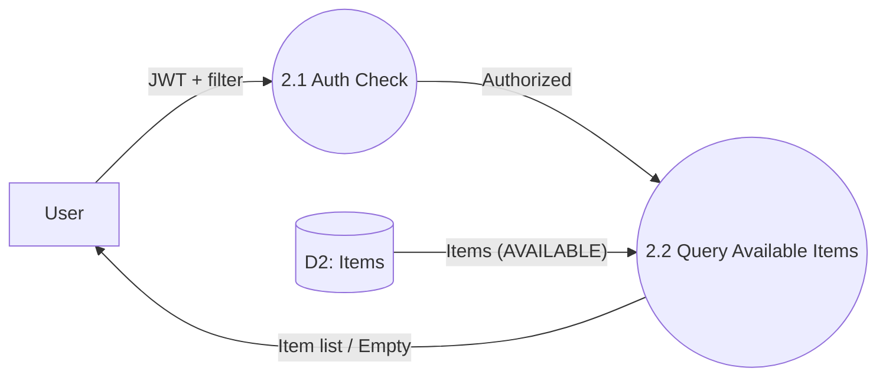
```mermaid
flowchart LR
    U["User"]
    P1(("2.1 Auth Check"))
    P2(("2.2 Query Available Items"))
    D2[("D2: Items")]

    U -->|"JWT + filter"| P1
    P1 -->|"Authorized"| P2
    D2 -->|"Items (AVAILABLE)"| P2
    P2 -->|"Item list / Empty"| U
```

### US-02 UML Activity

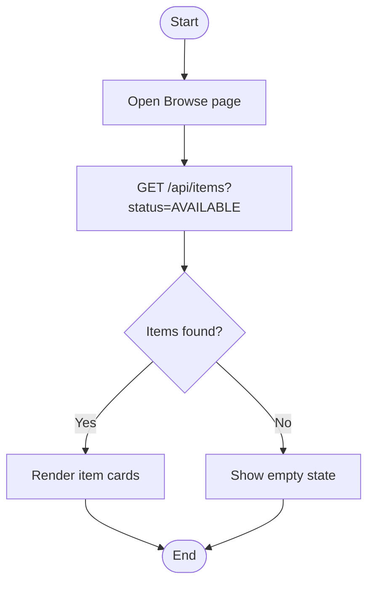
```mermaid
flowchart TD
    S(["Start"]) --> A["Open Browse page"]
    A --> B["GET /api/items?status=AVAILABLE"]
    B --> C{"Items found?"}
    C -->|"Yes"| D["Render item cards"]
    C -->|"No"| E["Show empty state"]
    D --> Z(["End"])
    E --> Z
```

### US-02 UML Sequence

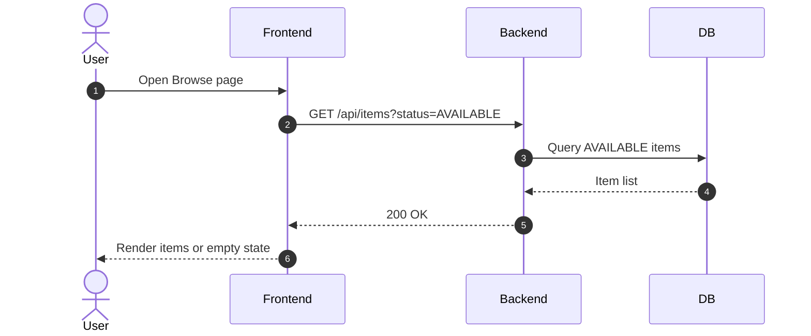
```mermaid
sequenceDiagram
    autonumber
    actor User
    participant FE as Frontend
    participant BE as Backend
    participant DB

    User->>FE: Open Browse page
    FE->>BE: GET /api/items?status=AVAILABLE
    BE->>DB: Query AVAILABLE items
    DB-->>BE: Item list
    BE-->>FE: 200 OK
    FE-->>User: Render items or empty state
```

---

## US-03: Submit Borrow Request

### US-03 Data Flow (DFD)

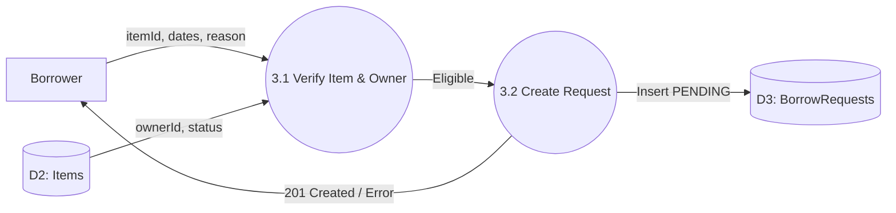
```mermaid
flowchart LR
    U["Borrower"]
    P1(("3.1 Verify Item & Owner"))
    P2(("3.2 Create Request"))
    D2[("D2: Items")]
    D3[("D3: BorrowRequests")]

    U -->|"itemId, dates, reason"| P1
    D2 -->|"ownerId, status"| P1
    P1 -->|"Eligible"| P2
    P2 -->|"Insert PENDING"| D3
    P2 -->|"201 Created / Error"| U
```

### US-03 UML Activity

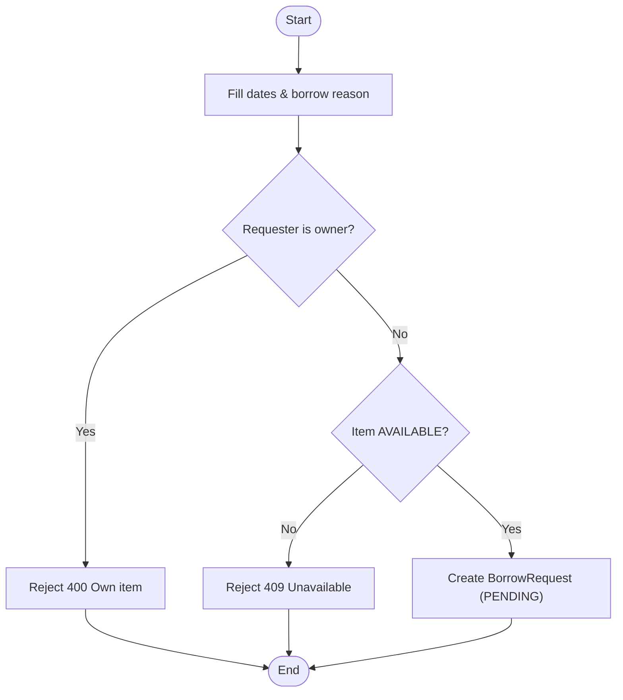
```mermaid
flowchart TD
    S(["Start"]) --> A["Fill dates & borrow reason"]
    A --> C1{"Requester is owner?"}
    C1 -->|"Yes"| E1["Reject 400 Own item"]
    C1 -->|"No"| C2{"Item AVAILABLE?"}
    C2 -->|"No"| E2["Reject 409 Unavailable"]
    C2 -->|"Yes"| B["Create BorrowRequest (PENDING)"]
    E1 --> Z(["End"])
    E2 --> Z
    B --> Z
```

### US-03 UML Sequence

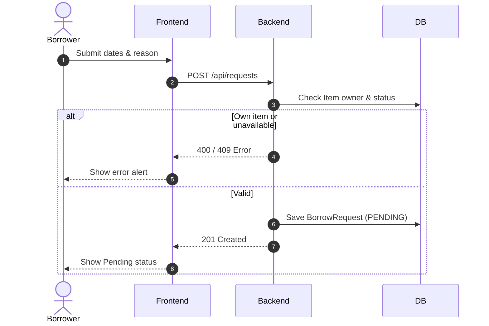
```mermaid
sequenceDiagram
    autonumber
    actor Borrower
    participant FE as Frontend
    participant BE as Backend
    participant DB

    Borrower->>FE: Submit dates & reason
    FE->>BE: POST /api/requests
    BE->>DB: Check Item owner & status
    alt Own item or unavailable
        BE-->>FE: 400 / 409 Error
        FE-->>Borrower: Show error alert
    else Valid
        BE->>DB: Save BorrowRequest (PENDING)
        BE-->>FE: 201 Created
        FE-->>Borrower: Show Pending status
    end
```

---

## US-04: Update or Delete Item Listing

### US-04 Data Flow (DFD)

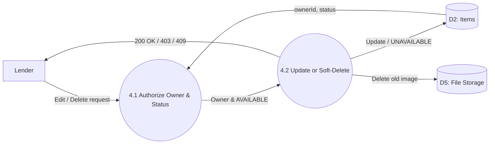
```mermaid
flowchart LR
    U["Lender"]
    P1(("4.1 Authorize Owner & Status"))
    P2(("4.2 Update or Soft-Delete"))
    D2[("D2: Items")]
    D5[("D5: File Storage")]

    U -->|"Edit / Delete request"| P1
    D2 -->|"ownerId, status"| P1
    P1 -->|"Owner & AVAILABLE"| P2
    P2 -->|"Update / UNAVAILABLE"| D2
    P2 -->|"Delete old image"| D5
    P2 -->|"200 OK / 403 / 409"| U
```

### US-04 UML Activity

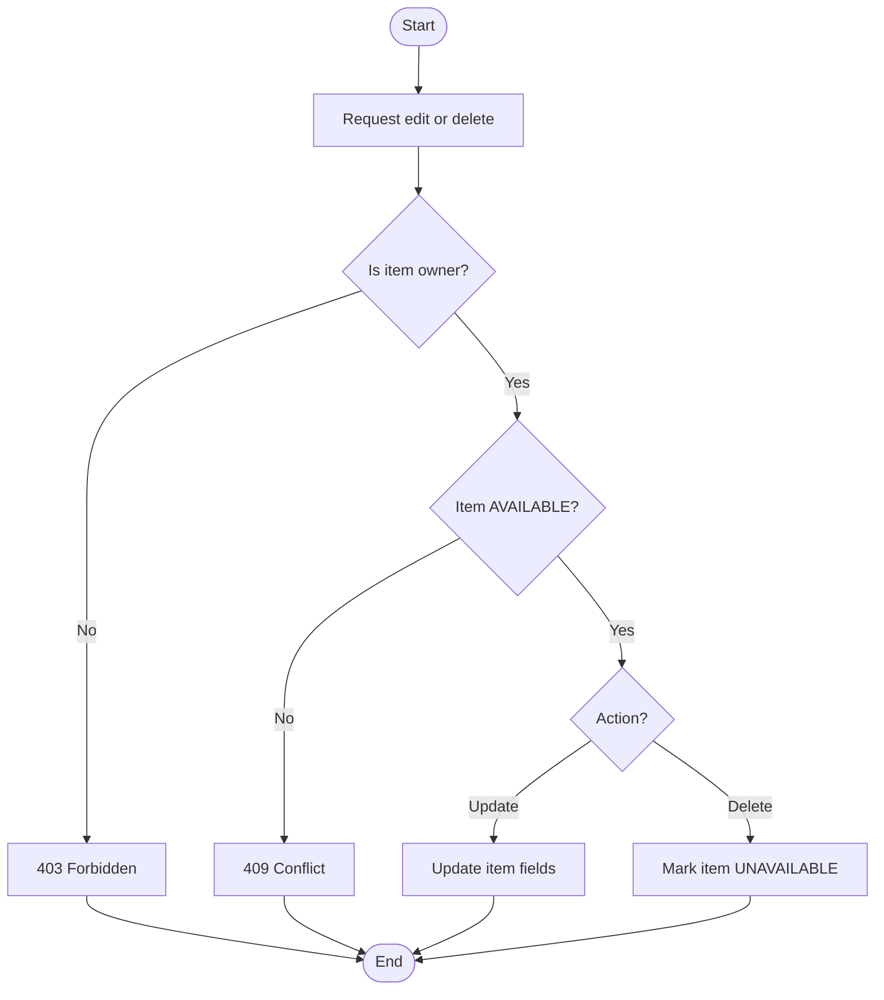
```mermaid
flowchart TD
    S(["Start"]) --> A["Request edit or delete"]
    A --> C1{"Is item owner?"}
    C1 -->|"No"| E1["403 Forbidden"]
    C1 -->|"Yes"| C2{"Item AVAILABLE?"}
    C2 -->|"No"| E2["409 Conflict"]
    C2 -->|"Yes"| C3{"Action?"}
    C3 -->|"Update"| U["Update item fields"]
    C3 -->|"Delete"| D["Mark item UNAVAILABLE"]
    E1 --> Z(["End"])
    E2 --> Z
    U --> Z
    D --> Z
```

### US-04 UML Sequence

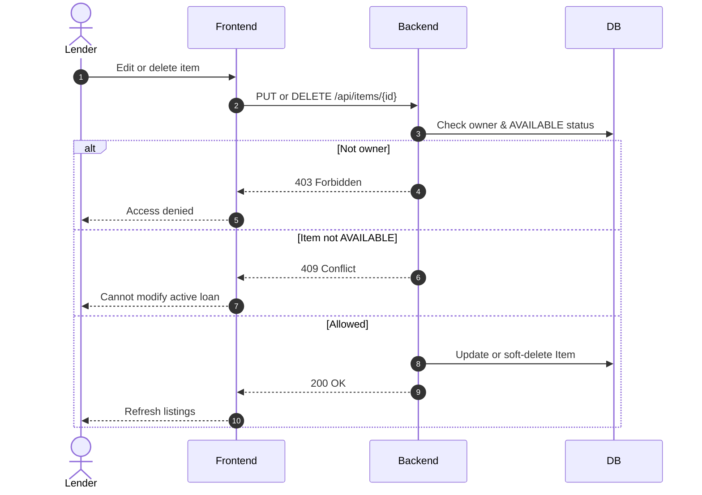
```mermaid
sequenceDiagram
    autonumber
    actor Lender
    participant FE as Frontend
    participant BE as Backend
    participant DB

    Lender->>FE: Edit or delete item
    FE->>BE: PUT or DELETE /api/items/{id}
    BE->>DB: Check owner & AVAILABLE status
    alt Not owner
        BE-->>FE: 403 Forbidden
        FE-->>Lender: Access denied
    else Item not AVAILABLE
        BE-->>FE: 409 Conflict
        FE-->>Lender: Cannot modify active loan
    else Allowed
        BE->>DB: Update or soft-delete Item
        BE-->>FE: 200 OK
        FE-->>Lender: Refresh listings
    end
```

---

## US-05: Approve or Reject Borrow Request

### US-05 Data Flow (DFD)

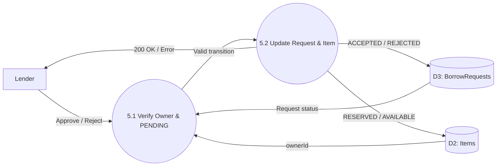
```mermaid
flowchart LR
    U["Lender"]
    P1(("5.1 Verify Owner & PENDING"))
    P2(("5.2 Update Request & Item"))
    D3[("D3: BorrowRequests")]
    D2[("D2: Items")]

    U -->|"Approve / Reject"| P1
    D3 -->|"Request status"| P1
    D2 -->|"ownerId"| P1
    P1 -->|"Valid transition"| P2
    P2 -->|"ACCEPTED / REJECTED"| D3
    P2 -->|"RESERVED / AVAILABLE"| D2
    P2 -->|"200 OK / Error"| U
```

### US-05 UML Activity

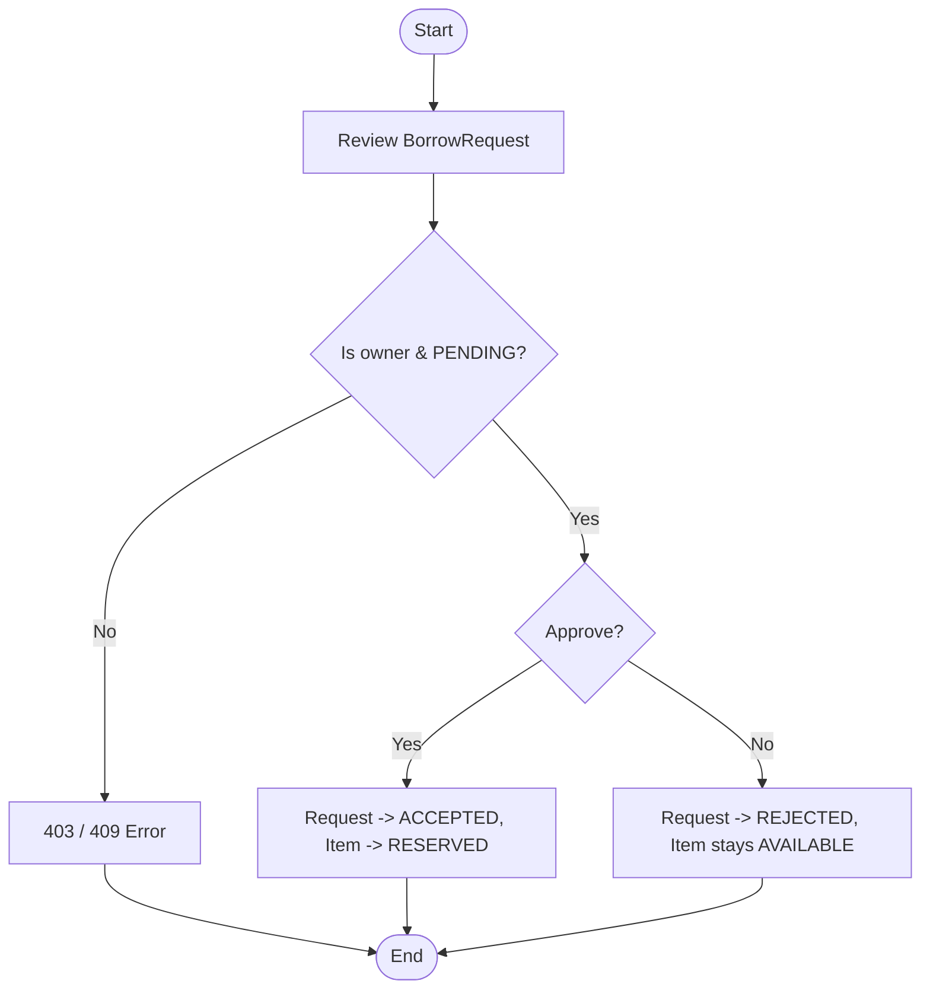
```mermaid
flowchart TD
    S(["Start"]) --> A["Review BorrowRequest"]
    A --> C1{"Is owner & PENDING?"}
    C1 -->|"No"| E["403 / 409 Error"]
    C1 -->|"Yes"| C2{"Approve?"}
    C2 -->|"Yes"| AP["Request -> ACCEPTED, Item -> RESERVED"]
    C2 -->|"No"| RJ["Request -> REJECTED, Item stays AVAILABLE"]
    E --> Z(["End"])
    AP --> Z
    RJ --> Z
```

### US-05 UML Sequence

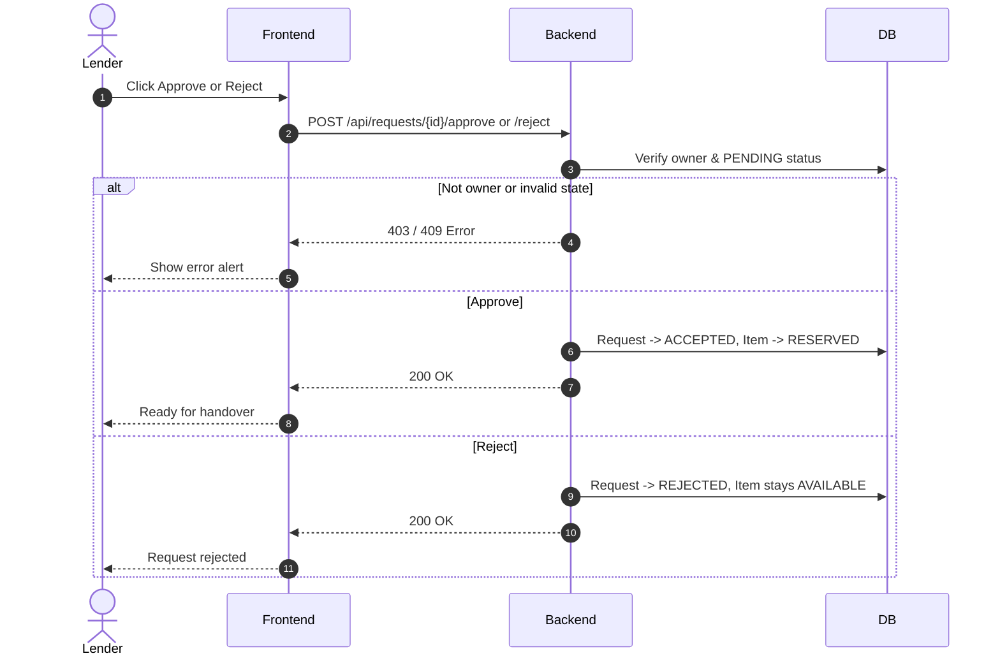
```mermaid
sequenceDiagram
    autonumber
    actor Lender
    participant FE as Frontend
    participant BE as Backend
    participant DB

    Lender->>FE: Click Approve or Reject
    FE->>BE: POST /api/requests/{id}/approve or /reject
    BE->>DB: Verify owner & PENDING status
    alt Not owner or invalid state
        BE-->>FE: 403 / 409 Error
        FE-->>Lender: Show error alert
    else Approve
        BE->>DB: Request -> ACCEPTED, Item -> RESERVED
        BE-->>FE: 200 OK
        FE-->>Lender: Ready for handover
    else Reject
        BE->>DB: Request -> REJECTED, Item stays AVAILABLE
        BE-->>FE: 200 OK
        FE-->>Lender: Request rejected
    end
```

---

## US-06: Record Handover Evidence

### US-06 Data Flow (DFD)

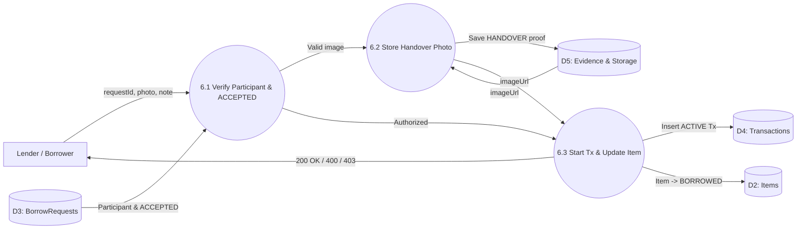
```mermaid
flowchart LR
    U["Lender / Borrower"]
    P1(("6.1 Verify Participant & ACCEPTED"))
    P2(("6.2 Store Handover Photo"))
    P3(("6.3 Start Tx & Update Item"))
    D3[("D3: BorrowRequests")]
    D5[("D5: Evidence & Storage")]
    D4[("D4: Transactions")]
    D2[("D2: Items")]

    U -->|"requestId, photo, note"| P1
    D3 -->|"Participant & ACCEPTED"| P1
    P1 -->|"Valid image"| P2
    P2 -->|"Save HANDOVER proof"| D5
    D5 -->|"imageUrl"| P2
    P1 -->|"Authorized"| P3
    P2 -->|"imageUrl"| P3
    P3 -->|"Insert ACTIVE Tx"| D4
    P3 -->|"Item -> BORROWED"| D2
    P3 -->|"200 OK / 400 / 403"| U
```

### US-06 UML Activity

```mermaid
flowchart TD
    S(["Start"]) --> A["Open Accepted request"]
    A --> C1{"Participant?"}
    C1 -->|"No"| E1["403 Forbidden"]
    C1 -->|"Yes"| C2{"Image & note provided?"}
    C2 -->|"No"| E2["400 Validation error"]
    C2 -->|"Yes"| B["Save Proof (HANDOVER), Tx (ACTIVE), Item -> BORROWED"]
    E1 --> Z(["End"])
    E2 --> Z
    B --> Z
```

### US-06 UML Sequence

```mermaid
sequenceDiagram
    autonumber
    actor User as Lender / Borrower
    participant FE as Frontend
    participant BE as Backend
    participant Storage
    participant DB

    User->>FE: Upload handover photo & note
    FE->>BE: POST /api/transactions/start/{requestId} & /api/evidence/transaction/{id}
    alt Missing image or non-participant
        BE-->>FE: 400 / 403 Error
        FE-->>User: Show error alert
    else Valid
        BE->>Storage: Store photo
        Storage-->>BE: imageUrl
        BE->>DB: Transaction (ACTIVE), Proof (HANDOVER), Item -> BORROWED
        BE-->>FE: 200 OK
        FE-->>User: Status updated to Borrowed
    end
```

---

## US-07: Record Return Evidence

### US-07 Data Flow (DFD)

```mermaid
flowchart LR
    U["Lender / Borrower"]
    P1(("7.1 Verify Participant & ACTIVE Tx"))
    P2(("7.2 Store Return Photo"))
    P3(("7.3 Complete Tx & Release Item"))
    D4[("D4: Transactions")]
    D5[("D5: Evidence & Storage")]
    D2[("D2: Items")]

    U -->|"transactionId, photo, note"| P1
    D4 -->|"Participant & ACTIVE"| P1
    P1 -->|"Valid image"| P2
    P2 -->|"Save RETURN proof"| D5
    D5 -->|"imageUrl"| P2
    P1 -->|"Authorized"| P3
    P2 -->|"imageUrl"| P3
    P3 -->|"Update Tx COMPLETED"| D4
    P3 -->|"Item -> AVAILABLE"| D2
    P3 -->|"200 OK / 400 / 403"| U
```

### US-07 UML Activity

```mermaid
flowchart TD
    S(["Start"]) --> A["Open Borrowed transaction"]
    A --> C1{"Participant?"}
    C1 -->|"No"| E1["403 Forbidden"]
    C1 -->|"Yes"| C2{"Image & note provided?"}
    C2 -->|"No"| E2["400 Validation error"]
    C2 -->|"Yes"| B["Save Proof (RETURN), Tx -> COMPLETED, Item -> AVAILABLE"]
    E1 --> Z(["End"])
    E2 --> Z
    B --> Z
```

### US-07 UML Sequence

```mermaid
sequenceDiagram
    autonumber
    actor User as Lender / Borrower
    participant FE as Frontend
    participant BE as Backend
    participant Storage
    participant DB

    User->>FE: Upload return photo & note
    FE->>BE: POST /api/evidence/transaction/{id} & /api/transactions/{id}/complete
    alt Missing image or non-participant
        BE-->>FE: 400 / 403 Error
        FE-->>User: Show error alert
    else Valid
        BE->>Storage: Store photo
        Storage-->>BE: imageUrl
        BE->>DB: Proof (RETURN), Transaction -> COMPLETED, Item -> AVAILABLE
        BE-->>FE: 200 OK
        FE-->>User: Status updated to Returned & Available
    end
```

---

## US-08: View Borrow History & Evidence

### US-08 Data Flow (DFD)

```mermaid
flowchart LR
    U["User (Participant / Outsider)"]
    P1(("8.1 Authorize Participant"))
    P2(("8.2 Load Timeline & Proofs"))
    D3[("D3: BorrowRequests")]
    D4[("D4: Transactions")]
    D5[("D5: Evidence & Storage")]

    U -->|"Query history"| P1
    D3 -->|"Request parties"| P1
    D4 -->|"Lender & Borrower"| P1
    P1 -->|"Authorized"| P2
    D4 -->|"Timestamps & status"| P2
    D5 -->|"Handover & return proofs"| P2
    P2 -->|"Timeline & photos / 403"| U
```

### US-08 UML Activity

```mermaid
flowchart TD
    S(["Start"]) --> A["Request borrow history & proofs"]
    A --> C1{"Record exists?"}
    C1 -->|"No"| E1["404 Not Found"]
    C1 -->|"Yes"| C2{"Lender or Borrower?"}
    C2 -->|"No"| E2["403 Forbidden"]
    C2 -->|"Yes"| B["Display timeline, photos & timestamps"]
    E1 --> Z(["End"])
    E2 --> Z
    B --> Z
```

### US-08 UML Sequence

```mermaid
sequenceDiagram
    autonumber
    actor User
    participant FE as Frontend
    participant BE as Backend
    participant DB

    User->>FE: Open borrow history & evidence
    FE->>BE: GET /api/transactions/borrower/{id} or /item/{itemId}
    BE->>DB: Fetch Transaction & EvidenceProof
    alt Non-participant
        BE-->>FE: 403 Forbidden
        FE-->>User: Access denied
    else Participant
        BE-->>FE: 200 OK (handover & return proofs)
        FE-->>User: Render photos, notes & timestamps
    end
```

---

## US-09: Login with TU Account

### US-09 Data Flow (DFD)

```mermaid
flowchart LR
    U["User"]
    TU["TU REST API"]
    P1(("9.1 Validate Format"))
    P2(("9.2 Check Cache & IP Limit"))
    P3(("9.3 Verify TU API"))
    P4(("9.4 Upsert User & JWT"))
    D6[("D6: RAM Cache & Limit")]
    D1[("D1: Users")]

    U -->|"username, password"| P1
    P1 -->|"Valid format"| P2
    P2 <-->|"HMAC cache & IP counter"| D6
    P2 -->|"Cache miss"| P3
    P2 -->|"Cache hit"| P4
    P3 -->|"POST /auth/Ad/verify"| TU
    TU -->|"Status, profile, role"| P3
    P3 -->|"Store 5m cache"| D6
    P3 -->|"Active profile"| P4
    P4 <-->|"Upsert (no passwordHash)"| D1
    P4 -->|"JWT & user / 401 / 403 / 429"| U
```

### US-09 UML Activity

```mermaid
flowchart TD
    S(["Start"]) --> A["Submit credentials"]
    A --> C1{"Valid format?"}
    C1 -->|"No"| E1["400 Bad Request"]
    C1 -->|"Yes"| C2{"5m Cache hit?"}
    C2 -->|"Yes"| OK["Upsert user & issue JWT"]
    C2 -->|"No"| C3{"IP <= 5 / 10m?"}
    C3 -->|"No"| E2["429 Too Many Requests"]
    C3 -->|"Yes"| C4{"TU API valid & active?"}
    C4 -->|"Invalid"| E3["401 Unauthorized"]
    C4 -->|"Inactive"| E4["403 Account Inactive"]
    C4 -->|"Active"| CA["Cache 5m TTL"] --> OK
    OK --> Z(["End"])
    E1 --> Z
    E2 --> Z
    E3 --> Z
    E4 --> Z
```

### US-09 UML Sequence

```mermaid
sequenceDiagram
    autonumber
    actor User
    participant FE as Frontend
    participant BE as Backend
    participant Guard as Cache & RateLimit
    participant TU as TU REST API
    participant DB

    User->>FE: Submit credentials
    FE->>BE: POST /api/auth/login
    alt Invalid format
        BE-->>FE: 400 Bad Request
    else Cache hit
        Guard-->>BE: Cached profile
        BE->>DB: Upsert user (no passwordHash)
        BE-->>FE: 200 OK {JWT, user}
    else Cache miss
        BE->>Guard: Check IP limit (5 / 10m)
        alt Exceeded
            Guard-->>BE: 429 Too Many Requests
        else Allowed
            BE->>TU: POST /auth/Ad/verify
            alt Invalid or Inactive
                TU-->>BE: 401 / 403 Error
                BE-->>FE: 401 / 403 Error
            else Active account
                TU-->>BE: 200 {profile, role}
                BE->>Guard: Cache profile (5m TTL)
                BE->>DB: Upsert user (STUDENT / STAFF)
                BE-->>FE: 200 OK {JWT, user}
            end
        end
    end
    FE-->>User: Redirect home or show alert
```
