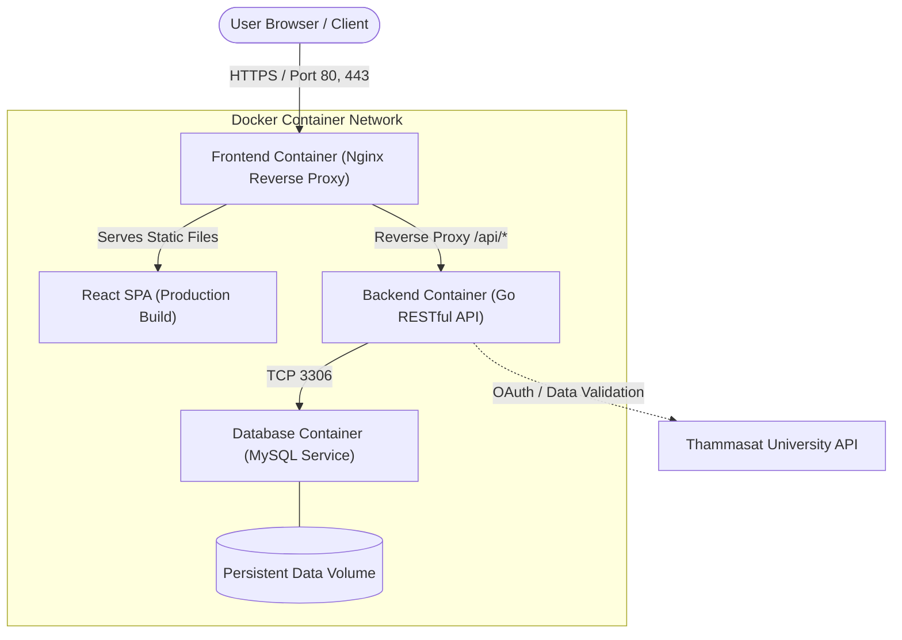

# BorrowingService — Technical Architecture & Tech Stack

> **Related Notes:** [[CS261]] | [[Diagram]] | [[Software Process]] | [[System Engineer]]

---

## 1. Project Overview & Multi-Container Architecture

The **BorrowingService** is an automated item borrowing and returning management system developed for Thammasat University students and staff. The entire system is engineered under a microservices and containerized architecture orchestrated via **Docker**, divided into 3 core isolated containers:

---

## 2. Component Technology Breakdown

### A. Frontend Tier

- **UI Framework:** React (Single Page Application)
- **Styling & Layout:** Bootstrap
- **Web Server & Reverse Proxy:** Nginx Container
  - Delivers high-performance production static builds.
  - Proxies incoming `/api/*` traffic to the backend Go container, eliminating Cross-Origin Resource Sharing (CORS) complications.

### B. Backend API Tier

- **Programming Language:** Go (Golang)
- **Architecture:** RESTful API with modular clean architecture.
- **Containerization:** Multi-stage Docker build producing a minimal, secure scratch/alpine executable binary.
- **Responsibilities:**
  - Business logic execution (borrowing rules, reservation deadlines, item lifecycle management).
  - Authentication and authorization with Thammasat University single-sign-on (TU API).
  - Transaction integrity and permission verification.

### C. Database & Persistence Tier

- **DBMS:** MySQL Relational Database
- **Schema & Data:** Transaction records, asset inventory, user audit logs, and approval histories.
- **Data Persistence:** Mounted **Docker Persistent Volume** to guarantee zero data loss upon container termination, restarts, or image rebuilds.

---

## 3. Project Documentation & Diagrams in Vault

All accompanying UML design diagrams are located in `docs/`:

- **Use Cases:** `docs/useCase.puml`
- **Domain Model:** `docs/domainDiagram.puml`
- **Activity Diagram:** `docs/activityDiagram.puml`
- **Sequence Diagrams:**
  - Authentication Flow: `docs/loginSequenceDiagram.puml`
  - Borrowing Transaction: `docs/serviceSequenceDiagram.puml`
- **Backend Class Diagram:** `docs/backendClassDiagram_draft.puml`
- **User Stories (`docs/userstorys/`):**
  - `login.puml`, `newpost.puml`, `lookup.puml`, `sendrequest.puml`, `apprvorrej.puml`, `history.puml`, `rmoreditpost.puml`, `history-send-bor-look.puml`, `historyofsubmis.puml`
